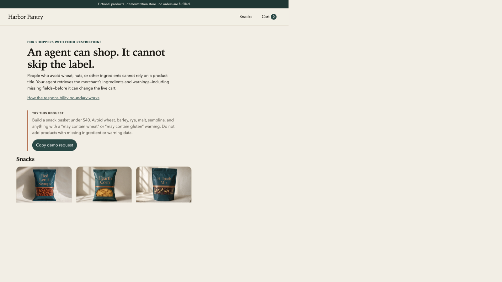

# Harbor Pantry

**An agent can shop. It cannot skip the label.**



Harbor Pantry is a fictional grocery storefront for the [OpenAI WebMCP Challenge](https://webmcp.devpost.com/) (August–September 2026). The shop name is Harbor Pantry. The Devpost entry name is TrustCart.

## Problem

Shopping agents can already search a catalog and add to a cart. For many people, these are exciting times. For people who avoid gluten, dairy, or animal products, and for people with severe allergies, that kind of shopping is not yet possible. An agent matches on title, description, or tags. It skips products they would be happy to buy.

A person allergic to nuts or seafood must read ingredients and “may contain” lines. Food made in a facility that also handles those foods can still cause a severe reaction. They still go to a store to check the label, if the product is even sold nearby.

## Solution

The agent must retrieve the merchant’s current ingredients and label statements before it can change the live cart. That includes fields the merchant did not supply. The store does not decide whether a snack is suitable. The shopper supplies restrictions. The merchant supplies facts. The shopper’s agent compares them.

## Try it

1. Enable `chrome://flags/#enable-webmcp-testing` in Chrome 151 or later. Relaunch Chrome if you just changed the flag.
2. Open the unpublished theme [Food Disclosure](https://demo-food-disclosure.myshopify.com/?preview_theme_id=190341972266). The store is password-protected. Judges will find the visitor password on Devpost. It is not in this repository.
3. On the store tab, open DevTools. Open **Application → WebMCP**. The click path is in [docs/chrome-slice.md](docs/chrome-slice.md).
4. Confirm native commerce tools and `get_product_food_disclosures` both appear.
5. Ask the agent to add Harbor Salt Potato Chips without retrieval. The cart must not change.
6. Call `get_product_food_disclosures` for that product. Then retry the add. The cart must update.
7. Retrieve Hillpath Trail Mix. Confirm `label_statements` is `null`, not `[]`.
8. Repeat in ChatGPT desktop. Do not use the Luna model.
9. Confirm a human can still add and remove items with the ordinary product form.

## Why this project exists

This project exists to offer a solution for shoppers with food restrictions.

WebMCP is the right tool for that. Native Shopify cart actions and a custom disclosure tool share one merchant page. The storefront can reject `update_cart` until retrieval runs for that product version. A side-channel API would not sit on that path. The agent could skip it.

The bootstrap loads before `{{ content_for_header }}`. Shopify then injects native tools. Any Online Store 2.0 theme can host this contract, including Horizon. This repo uses a small original theme so the gate stays visible.

## How it works

1. The shopper goes to the shop website with a shopping agent.
2. The page loads the merchant’s current ingredients and label statements.
3. The shopper tells the agent which foods to avoid on this trip.
4. The agent calls `get_product_food_disclosures` before it adds a product.
5. The tool returns those facts, including missing fields. The page stores a receipt in this tab.
6. The agent compares merchant facts to the shopper’s restrictions. The store does not judge suitability.
7. Native `update_cart` can increase a cart line only when that receipt is current. Without it, the cart does not change.

A receipt records that retrieval ran for this product version in this tab. It does not mean the agent understood the label. It does not mean the snack is suitable. This gate applies to the native `update_cart` path on this demo. A human can still use the ordinary product form.

## Custom tool

| Field                  | Value                           |
| ---------------------- | ------------------------------- |
| Name                   | `get_product_food_disclosures`  |
| Title                  | Retrieve food disclosures       |
| Input                  | 1–4 unique Shopify Product GIDs |
| `readOnlyHint`         | `false`                         |
| `untrustedContentHint` | `true`                          |

Returned fields:

- `ingredients`: `string` or `null`
- `label_statements`: `string[]` or `null`

`null` means the merchant did not supply that field. Do not treat `null` as “none”. An empty `label_statements` array (`[]`) means the merchant supplied a record with no separate label statement.

## Catalog

Local records live in [fixtures/products.json](fixtures/products.json). There are exactly 12 fictional snacks. All 12 are on the Dev store collection `food-disclosure-demo`.

Shopper-facing copy uses Harbor Pantry. Do not put “Trust”, “Safe”, or “Verified” in the shop name.

The catalog keeps missing data distinct from empty data. Harbor Salt Potato Chips has `label_statements: []`. Hillpath Trail Mix has `label_statements: null`. Hearth Corn Chips has `ingredients: null`. Millhouse Savory Crackers has a non-empty `label_statements` list: `Contains wheat.`

## Local setup

```bash
npm ci
npm run typecheck
npm test
npm run build
npm run theme:check
npm run generate:fixtures
```

To push the theme or change the live catalog, follow [docs/step-by-step.md](docs/step-by-step.md).

## Limits

- United States English and USD only.
- One original Online Store 2.0 theme. It is not Dawn, Horizon, Skeleton, or Slate.
- No backend, no medical engine, no AI API, and no real checkout.
- Human add, remove, and quantity decrease use normal Shopify forms. They are not gated.

## License

MIT. See [LICENSE](LICENSE). The theme and application source in this repository are original.
